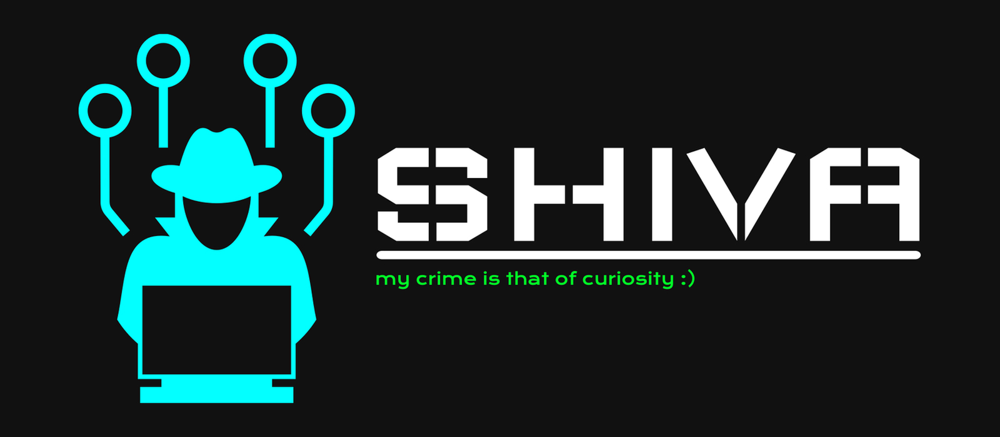

<head>
  <link rel="icon" type="image/png" href="favicon.png">
    </head>
<h1 align="center">HelloWorld, I'm Mr.Damain</h1>
<h2 align="center">A Passionate RealTime Pentester/Developer from India.</h2>

  

  

- 🌱 I’m currently learning CS*Enginering

- **👨‍💻 All of my projects are available** 

- 💬 Ask me about **linux/os/networking/AI/ML/BASH**
-  **Click to inbox me :** 

- **📄 Know about my experiences** 

- **⚡ Fact** Religion is Politics Dug:)

<h3 align="left">Connect with me:</h3>

<h3 align="left">Languages and Tools:</h3>

                                                         

<h3 align="left">Support:</h3>

 

&nbsp;

&nbsp;

